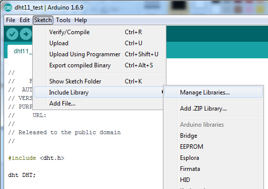
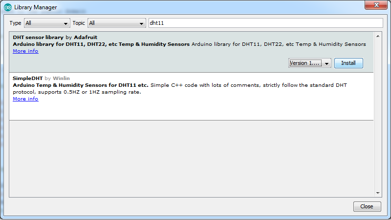
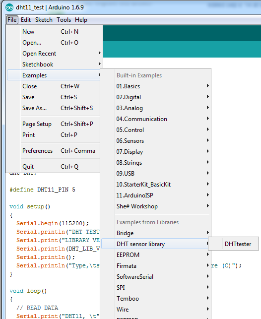
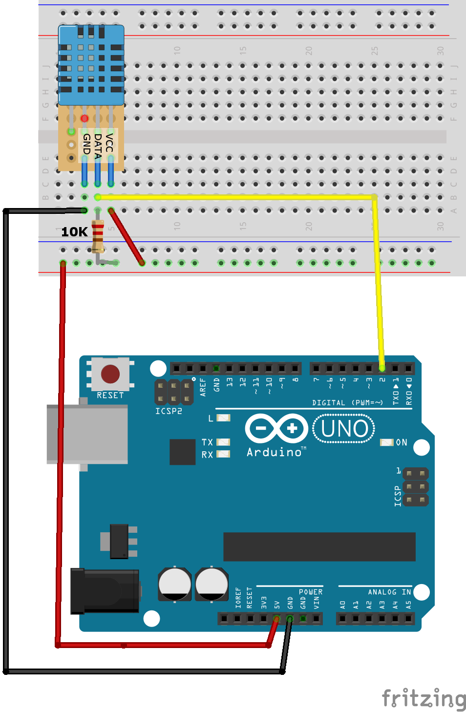

# arduino-dht11
Arduino Uno example project using DHT11


## How to install DHT11 Library

> This is a short description on how to install the required library for DHT11 temperature and humidity sensor. 
> If you're already familiar with installing libraries on Arduino feel free to skip this section.

1. Open Arduino.exe
2. Go to Sketch > Include Library > Manage Libraries...
    
3. Type in **dht11**
4. You should see DHT sensor library by Adafruit in the list. Click Install.
    
5. Installation should complete shortly and INSTALLED should appear next to the library name. Click Clse.
6. That's Done! Go to File > Examples and you should now see DHT sensor library in the list.
  


## Example - DHTtester

> This is a simple walkthough of setting up a basic circuit using Arduino Uno and DHT11.
> It uses the example sketch that's included in the DHT Sensor library.

### Part 1 - Sketch
1. Go to File > Examples > DHT sensor library > DHTtester
  
2. That should open the example sketch.
3. Before doing anything else, make sure you've selected the correct type - DHT11
4. To do that, uncomment `#define DHTTYPE DHT11`  

  ```  
	// Uncomment whatever type you're using!
	#define DHTTYPE DHT11   // DHT 11
	//#define DHTTYPE DHT22   // DHT 22  (AM2302), AM2321
	//#define DHTTYPE DHT21   // DHT 21 (AM2301)
  ```

5. Make sure that correct Board and Port is selected 
6. Click Upload.

### Part 2 - Circuit
Now let's set up the circuit. This is a very simple circuit.
Before we begin, this is the DHT11 module I'm using in this example.


1. Set up the breadboard as following.
  
  

2. Once it's set up, plug in the USB and it should be running.
3. Open Serial Monitor from Arduino. 
  > Magnifier icon at the top right corner, or go to Tools > Serial Monitor
4. Make sure that the Serial monitor setup is correctly set to 9600 baud and line endings to Both NL & CR.
5. You should see messages similar to below appear.  

 >  DHTxx test!
 >  Humidity: 65.00 %	Temperature: 18.00 *C 64.40 *F	Heat index: 17.55 *C 63.59 *F
 >  Humidity: 65.00 %	Temperature: 18.00 *C 64.40 *F	Heat index: 17.55 *C 63.59 *F

